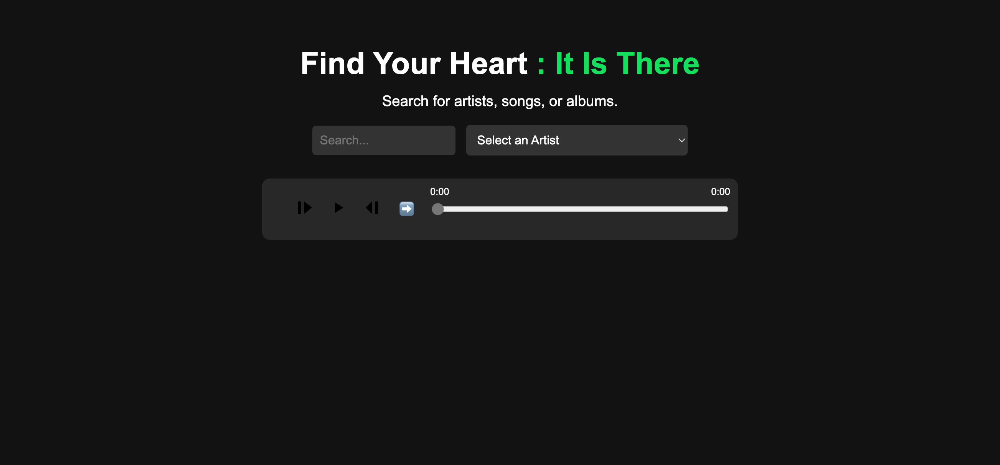

# Music Explorer

This project is a web application designed to help users discover music based on the search bar and drop-down list. Utilizing the Spotify API, Music Explorer provides a seamless and enjoyable experience for users to find songs that match their current feelings.

## Demo

Explore the functionality of the Music Explorer platform by visiting: [music-explorer](https://music-explorer.netlify.app/)

## Contact

For any inquiries or issues, please open an issue on the repository or contact aaungdev@outlook.com